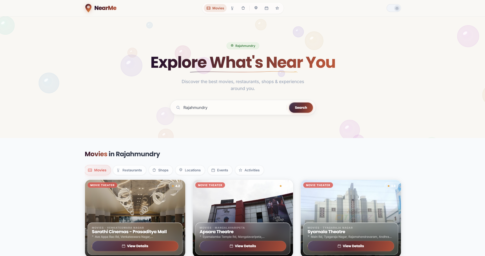
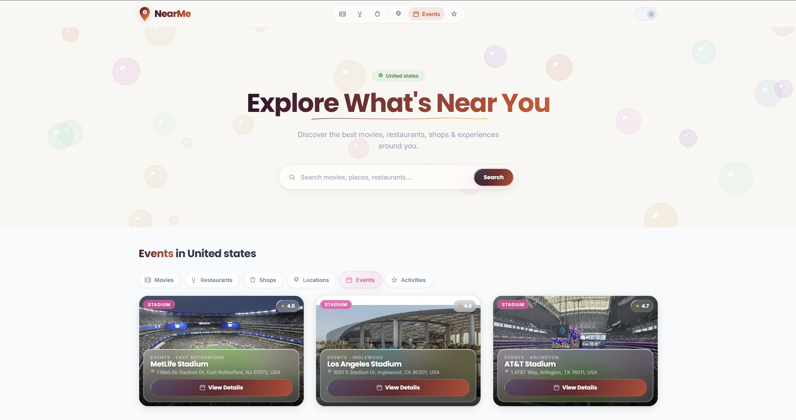
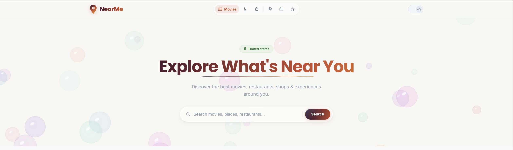
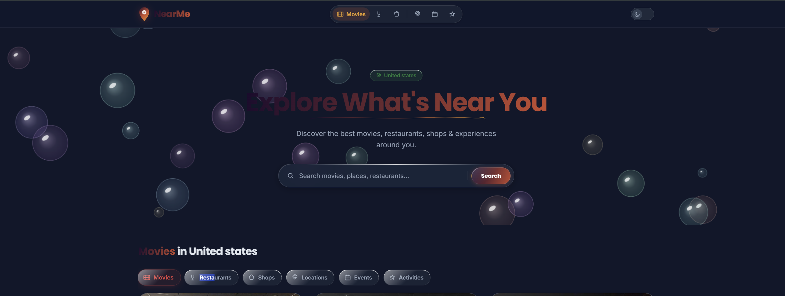

<div align="center">


<br/><br/>

**A full-stack city explorer that pulls real-time places, photos & maps from Google**

<br/>


</div>

---

## What is NearMe?

NearMe is a full-stack **city explorer web app** built as a Semester 3 Object-Oriented Programming project. Search any Indian city and instantly discover real restaurants, cinemas, shops, landmarks, events, and activities — powered by the **Google Places API** with live photos and interactive maps.

---

## Screenshots

<div align="center">

| Home — Light Mode | Restaurants |
|:-:|:-:|
|  |  |

| Locations — Liquid Glass Cards | Detail Modal with Live Map |
|:-:|:-:|
|  |  |

</div>

---

## Features

- **Real-time Google Places data** — every search hits the Google Places API for live results
- **Live place photos** — actual Google place photos, not stock images
- **Interactive maps** — Google Maps embed inside every detail modal (all 6 categories)
- **6 categories** — Movies, Restaurants, Shops, Locations, Events, Activities
- **8 Indian cities** — Hyderabad, Mumbai, Chennai, Bangalore, Delhi, Vijayawada, Guntur, Rajahmundry
- **JWT authentication** — register / login with BCrypt-hashed passwords
- **Dark & Light themes** — full CSS variable theming with smooth transitions
- **Bubble hero animation** — interactive canvas with physics-based bubbles
- **3D tilt cards** — smooth perspective tilt on hover
- **Liquid glass UI** — backdrop-filter frosted glass cards with shimmer highlights
- **OpenStreetMap fallback** — free map tiles when no Google key is set
- **Graceful image fallback** — Google Photos → local static → Picsum seed
- **Race-condition safe** — AbortController cancels stale fetch requests

---

## Tech Stack

| Layer | Technology |
|---|---|
| **Backend** | Java 17, Spring Boot 3.2, Spring Data JPA, Spring Security |
| **Auth** | JWT (JJWT 0.12), BCrypt password hashing |
| **Database** | MySQL 8 (H2 in-memory for dev — zero config) |
| **Frontend** | React 18, vanilla CSS (no component library) |
| **Maps & Places** | Google Maps Embed API + Google Places Text Search API |
| **Maps (free fallback)** | OpenStreetMap + Nominatim geocoding |
| **Build** | Maven (backend), npm / Create React App (frontend) |
| **API Docs** | Springdoc OpenAPI — Swagger UI at `/swagger-ui.html` |

---

## Architecture

```
┌─────────────────────────────────────────────────────┐
│                  React 18 Frontend                   │
│  MAP_KEY set → /api/places (Google Places proxy)    │
│  No key     → /api/movies, /api/restaurants, ...    │
└──────────────────┬──────────────────────────────────┘
                   │ HTTP/REST + JWT Bearer
┌──────────────────▼──────────────────────────────────┐
│              Spring Boot 3.2 Backend                 │
│  ┌─────────────────┐   ┌──────────────────────────┐ │
│  │ GooglePlaces     │   │ Category Controllers     │ │
│  │ Controller       │   │ (Movies/Restaurants/...) │ │
│  └────────┬────────┘   └──────────────────────────┘ │
│           │ HTTPS                                    │
│  ┌────────▼────────┐   ┌──────────────────────────┐ │
│  │ GooglePlaces     │   │   H2 / MySQL             │ │
│  │ Service          │   │   (seed data for 8 cities)│ │
│  └─────────────────┘   └──────────────────────────┘ │
└─────────────────────────────────────────────────────┘
```

---

## Quick Start

### Prerequisites
- Java 17+, Maven 3.9+
- Node.js 18+, npm
- A Google Maps API key *(optional — app works without it using seed data)*

### 1. Clone

```bash
git clone https://github.com/vamsikoneru06/NearMe.git
cd NearMe
```

### 2. Backend

```bash
cd backend
# Create local secrets file (gitignored — never committed)
echo "GOOGLE_PLACES_KEY=your_key_here" > src/main/resources/application-local.properties

mvn spring-boot:run
# API running at http://localhost:8080
# Swagger UI at http://localhost:8080/swagger-ui.html
```

### 3. Frontend

```bash
cd FrontEnd
# Create local env file (gitignored — never committed)
echo "REACT_APP_BACKEND_URL=http://localhost:8080" > .env
echo "REACT_APP_MAP_API_KEY=your_key_here" >> .env

npm install
npm start
# App running at http://localhost:3000
```

> **No Google API key?** The app falls back to hardcoded seed data for all 8 cities with OpenStreetMap for maps — works completely offline.

---

## Environment Variables

| Variable | Where | Description |
|---|---|---|
| `GOOGLE_PLACES_KEY` | `application-local.properties` | Google Places API key for real-time data |
| `REACT_APP_MAP_API_KEY` | `FrontEnd/.env` | Same key — enables Google Maps embed |
| `REACT_APP_BACKEND_URL` | `FrontEnd/.env` | Backend base URL (default: `http://localhost:8080`) |
| `DB_URL` | env / `application-local.properties` | MySQL JDBC URL (H2 used if not set) |
| `JWT_SECRET` | env / `application-local.properties` | JWT signing secret (min 32 chars) |

> Copy `.env.example` to see the full list of available variables.

---

## API Reference

### Auth — `/api/auth`
| Method | Endpoint | Auth | Description |
|---|---|---|---|
| POST | `/api/auth/register` | No | Register — returns JWT |
| POST | `/api/auth/login` | No | Login — returns JWT |

### Places (Google-powered) — `/api/places`
| Method | Endpoint | Auth | Description |
|---|---|---|---|
| GET | `/api/places?city=Hyderabad&type=restaurant` | No | Real-time Google Places search |

### Category Data — `/api/*`
| Method | Endpoint | Auth | Description |
|---|---|---|---|
| GET | `/api/movies?location=Hyderabad` | No | Movies by city |
| GET | `/api/restaurants?location=Hyderabad` | No | Restaurants by city |
| GET | `/api/shops?location=Hyderabad` | No | Shops by city |
| GET | `/api/activities?location=Hyderabad` | No | Activities by city |
| GET | `/api/events?location=Hyderabad` | No | Events by city |
| GET | `/api/locations` | No | Curated geo-locations with lat/lng |

### Reviews & Favourites
| Method | Endpoint | Auth | Description |
|---|---|---|---|
| POST | `/api/locations/{id}/reviews` | Yes | Add review |
| GET | `/api/locations/{id}/reviews` | No | Get reviews |
| POST | `/api/favorites/{locationId}` | Yes | Save location |
| GET | `/api/favorites` | Yes | My saved locations |

All endpoints return structured JSON errors:
```json
{ "status": 404, "error": "Not Found", "message": "...", "timestamp": "..." }
```

---

## Security Notes

- Passwords hashed with BCrypt (strength 10)
- JWT tokens signed with HMAC-SHA256
- All secrets stored in gitignored local files only
- Input sanitised before Google Places API calls (length limit + character stripping)
- CORS locked to configured origin — not wildcard
- H2 console restricted (`web-allow-others=false`)

---

## Project Structure

```
NearMe/
├── BackEnd/                          # Spring Boot (Maven)
│   └── src/main/java/com/nearme/
│       ├── controller/               # REST controllers
│       ├── service/impl/             # Business logic
│       ├── repository/               # Spring Data JPA
│       ├── model/                    # JPA entities
│       ├── dto/                      # Request/response DTOs
│       ├── security/                 # JWT filter + config
│       ├── config/                   # CORS, seed data, OpenAPI
│       └── exception/                # Global error handler
├── FrontEnd/                         # React 18 (CRA)
│   └── src/
│       ├── App.js                    # Entire frontend (components + hooks)
│       └── App.css                   # All styles (design tokens + components)
├── .env.example                      # Environment variable reference
└── README.md
```

---

<div align="center">

Built with Java, Spring Boot, React & Google Maps API

</div>
